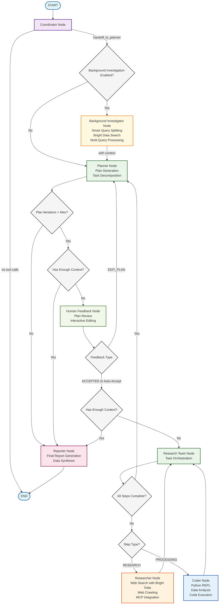

# 🌟 BrightFlow

[](https://www.python.org/downloads/)
[](https://opensource.org/licenses/MIT)
[](https://github.com/bytedance/deer-flow)

> **Demo Project**: A prototype showcase built upon DeerFlow, demonstrating Bright Data's web intelligence capabilities for research automation.

## 🧪 Project Status

**BrightFlow** is a **demonstration project** and **prototype** that showcases the integration of Bright Data's web intelligence platform with AI-powered research workflows. This is a **proof-of-concept** built for evaluation and testing purposes.

**Important Notes:**
- This is a **demo/prototype**, not a production-ready system
- Built as a **showcase** of Bright Data's capabilities integrated with AI research tools
- Based on the open-source DeerFlow framework by ByteDance

## 🙏 Attribution

**BrightFlow** is a fork of [DeerFlow](https://github.com/bytedance/deer-flow) by ByteDance. We acknowledge the original DeerFlow team and ByteDance for creating the Deep Research framework that serves as our foundation.

> **Original DeerFlow Description**: Deep Exploration and Efficient Research Flow - a community-driven Deep Research framework that builds upon the incredible work of the open source community.

## Demo

[TBD]


## 🚀 What Makes BrightFlow Different

Building upon DeerFlow's foundation, this **demonstration project** showcases enhanced capabilities through **Bright Data's web intelligence platform**:

### 🔍 **Enhanced Search Capabilities**
- **Bright Data Search Integration**: Leverages Bright Data's advanced search APIs for more comprehensive and accurate results
- **Enterprise-Grade Data Quality**: Access to cleaner, more reliable data sources through Bright Data's network
- **Global Coverage**: Enhanced search capabilities across different regions and languages

### 🕷️ **Advanced Web Crawling**
- **Bright Data Crawling**: Integrated Bright Data's robust crawling infrastructure
- **Anti-Bot Protection**: Access to protected content through Bright Data's proxy network
- **Scalable Data Collection**: Handle large-scale research projects with enterprise-grade crawling capabilities

### 🧠 **Intelligent Query Processing**
- **Smart Query Splitting**: Node that automatically breaks down complex user queries into multiple optimized sub-queries
- **Parallel Research**: Execute multiple research streams simultaneously for comprehensive coverage
- **Context Aggregation**: Combine results from multiple queries for richer, more complete insights

### 🎨 **Enhanced User Experience**
- **BrightFlow Branding**: Complete rebrand with improved visual design and user experience
- **Better Performance**: Optimized workflows leveraging Bright Data's infrastructure

## 📑 Table of Contents

- [🚀 Quick Start](#quick-start)
- [🌟 Features](#features)
- [🔧 Bright Data Configuration](#-bright-data-configuration)
- [🏗️ Architecture](#architecture)
- [🛠️ Development](#development)
- [🐳 Docker](#docker)
- [🗣️ Text-to-Speech Integration](#text-to-speech-integration)
- [❓ FAQ](#faq)
- [📜 License](#license)
- [💖 Acknowledgments](#acknowledgments)

## Quick Start

BrightFlow is developed in Python, and comes with a web UI written in Node.js. To ensure a smooth setup process, we recommend using the following tools:

### Recommended Tools

- **[`uv`](https://docs.astral.sh/uv/getting-started/installation/):**
  Simplify Python environment and dependency management. `uv` automatically creates a virtual environment in the root directory and installs all required packages for you—no need to manually install Python environments.

- **[`nvm`](https://github.com/nvm-sh/nvm):**
  Manage multiple versions of the Node.js runtime effortlessly.

- **[`pnpm`](https://pnpm.io/installation):**
  Install and manage dependencies of Node.js project.

### Environment Requirements

Make sure your system meets the following minimum requirements:

- **[Python](https://www.python.org/downloads/):** Version `3.12+`
- **[Node.js](https://nodejs.org/en/download/):** Version `22+`

### Installation

```bash
# Clone the repository
git clone https://github.com/your-username/bright-flow.git
cd bright-flow

# Install dependencies, uv will take care of the python interpreter and venv creation, and install the required packages
uv sync

# Configure .env with your API keys
# Bright Data: https://brightdata.com/ (Primary search and crawling provider)
# Tavily: https://app.tavily.com/home (Fallback search option)
# Brave Search: https://brave.com/search/api/ (Alternative search option)
# volcengine TTS: Add your TTS credentials if you have them
cp .env.example .env

# Configure conf.yaml for your LLM model and API keys
# Please refer to 'docs/configuration_guide.md' for more details
cp conf.yaml.example conf.yaml

# Install marp for ppt generation
# https://github.com/marp-team/marp-cli?tab=readme-ov-file#use-package-manager
brew install marp-cli
```

Optionally, install web UI dependencies via [pnpm](https://pnpm.io/installation):

```bash
cd bright-flow/web
pnpm install
```

### Configurations

Please refer to the [Configuration Guide](docs/configuration_guide.md) for more details.

> [!NOTE]
> Before you start the project, read the guide carefully, and update the configurations to match your specific settings and requirements. Make sure to configure your Bright Data credentials for optimal performance.

### Console UI

The quickest way to run the project is to use the console UI.

```bash
# Run the project in a bash-like shell
uv run main.py
```

### Web UI

This project also includes a Web UI, offering a more dynamic and engaging interactive experience with the new BrightFlow design.

> [!NOTE]
> You need to install the dependencies of web UI first.

```bash
# Run both the backend and frontend servers in development mode
# On macOS/Linux
./bootstrap.sh -d

# On Windows
bootstrap.bat -d
```

Open your browser and visit [`http://localhost:3000`](http://localhost:3000) to explore the enhanced BrightFlow web UI.

Explore more details in the [`web`](./web/) directory.

## 🔧 Bright Data Configuration

BrightFlow's enhanced capabilities are powered by Bright Data's enterprise-grade platform. To get started:

### Setting up Bright Data

1. **Sign up for Bright Data**: Visit [brightdata.com](https://brightdata.com/) to create your account
2. **Get API Credentials**: Obtain your API keys from the Bright Data dashboard
3. **Configure Environment**: Add your Bright Data credentials to your `.env` file:

```bash
# Bright Data Configuration (Primary)
BRIGHT_DATA_API_KEY=your_bright_data_api_key
BRIGHT_DATA_ZONE=your_unlocker_zone_name
BRIGHT_DATA_DEFAULT_ENGINE="<search_engine>"

# Fallback search engines (optional)
SEARCH_API=bright_data  # Primary search provider
TAVILY_API_KEY=your_tavily_key  # Fallback option
BRAVE_SEARCH_API_KEY=your_brave_key  # Alternative option
```

### Bright Data Features

- **Advanced Search API**: Access to comprehensive web search results with enterprise-grade quality
- **Web Scraping Network**: Leverage Bright Data's proxy network for reliable data collection
- **Global Data Access**: Collect data from any geography with local IP addresses
- **Anti-Detection**: Advanced techniques to bypass anti-bot measures

## Supported Search Engines

BrightFlow supports multiple search engines with **Bright Data as the primary and recommended option**:

- **Bright Data** (primary, recommended): Enterprise-grade search and crawling platform
  - Requires Bright Data API credentials in your `.env` file
  - Sign up at: https://brightdata.com/
  - **Best performance and data quality**

- **Tavily**: A specialized search API for AI applications
  - Requires `TAVILY_API_KEY` in your `.env` file
  - Sign up at: https://app.tavily.com/home

- **DuckDuckGo**: Privacy-focused search engine
  - No API key required

- **Brave Search**: Privacy-focused search engine with advanced features
  - Requires `BRAVE_SEARCH_API_KEY` in your `.env` file
  - Sign up at: https://brave.com/search/api/

- **Arxiv**: Scientific paper search for academic research
  - No API key required
  - Specialized for scientific and academic papers

To configure your preferred search engine, set the `SEARCH_API` variable in your `.env` file:

```bash
# Recommended: Use Bright Data for best results
SEARCH_API=bright_data

# Alternative options: tavily, duckduckgo, brave_search, arxiv
```

## Features

### Enhanced Core Capabilities

- 🤖 **LLM Integration**
  - Support for most models through [litellm](https://docs.litellm.ai/docs/providers)
  - Support for open source models like Qwen
  - OpenAI-compatible API interface
  - Multi-tier LLM system for different task complexities

### Advanced Tools and Integrations

- 🔍 **Enhanced Search and Retrieval**
  - **Primary**: Bright Data's enterprise search and crawling APIs
  - **Smart Query Processing**: Automatic query splitting for comprehensive coverage
  - **Parallel Research**: Multiple search streams for richer context
  - **Fallback Support**: Tavily, Brave Search, and other search engines
  - Advanced content extraction with enterprise-grade reliability

- 🔗 **MCP Seamless Integration**
  - Expand capabilities for private domain access, knowledge graph, web browsing and more
  - Facilitates integration of diverse research tools and methodologies
  - **Enhanced with Bright Data's data collection capabilities**

### Human Collaboration

- 🧠 **Human-in-the-loop**
  - Supports interactive modification of research plans using natural language
  - Supports auto-acceptance of research plans

- 📝 **Report Post-Editing**
  - Supports Notion-like block editing
  - Allows AI refinements, including AI-assisted polishing, sentence shortening, and expansion
  - Powered by [tiptap](https://tiptap.dev/)

### Content Creation

- 🎙️ **Podcast and Presentation Generation**
  - AI-powered podcast script generation and audio synthesis
  - Automated creation of simple PowerPoint presentations
  - Customizable templates for tailored content

## Architecture

BrightFlow implements an enhanced modular multi-agent system architecture designed for automated research and code analysis, **powered by Bright Data's enterprise infrastructure**. The system is built on LangGraph, enabling a flexible state-based workflow where components communicate through a well-defined message passing system.


Original Deerflow Architecture:


The system employs a streamlined workflow with the following enhanced components:

1. **Coordinator**: The entry point that manages the workflow lifecycle
   - Initiates the research process based on user input
   - Delegates tasks to the planner when appropriate
   - Acts as the primary interface between the user and the system

2. **Enhanced Planner**: Strategic component with intelligent query processing
   - **Smart Query Splitting**: Automatically breaks down complex queries into multiple optimized sub-queries
   - Analyzes research objectives and creates structured execution plans
   - Determines if enough context is available or if more research is needed
   - Manages parallel research streams for comprehensive coverage

3. **Enhanced Research Team**: Specialized agents with Bright Data integration:
   - **Advanced Researcher**: Conducts web searches using Bright Data's enterprise APIs, with intelligent query distribution and parallel processing
   - **Enhanced Crawler**: Utilizes Bright Data's crawling infrastructure for reliable data collection
   - **Coder**: Handles code analysis, execution, and technical tasks using Python REPL tool
   - Each agent has access to enterprise-grade tools optimized for their role

4. **Reporter**: Final stage processor for research outputs
   - Aggregates findings from multiple parallel research streams
   - Processes and structures the collected information with enhanced context
   - Generates comprehensive research reports with richer insights

## Text-to-Speech Integration

BrightFlow includes a Text-to-Speech (TTS) feature that allows you to convert research reports to speech. This feature uses the volcengine TTS API to generate high-quality audio from text. Features like speed, volume, and pitch are also customizable.

### Using the TTS API

You can access the TTS functionality through the `/api/tts` endpoint:

```bash
# Example API call using curl
curl --location 'http://localhost:8000/api/tts' \
--header 'Content-Type: application/json' \
--data '{
    "text": "This is a test of the text-to-speech functionality.",
    "speed_ratio": 1.0,
    "volume_ratio": 1.0,
    "pitch_ratio": 1.0
}' \
--output speech.mp3
```

## Development

### Testing

Run the test suite:

```bash
# Run all tests
make test

# Run specific test file
pytest tests/integration/test_workflow.py

# Run with coverage
make coverage
```

### Code Quality

```bash
# Run linting
make lint

# Format code
make format
```

### Debugging with LangGraph Studio

BrightFlow uses LangGraph for its workflow architecture. You can use LangGraph Studio to debug and visualize the enhanced workflow in real-time.

#### Running LangGraph Studio Locally

BrightFlow includes a `langgraph.json` configuration file that defines the graph structure and dependencies for the LangGraph Studio. This file points to the workflow graphs defined in the project and automatically loads environment variables from the `.env` file.

##### Mac

```bash
# Install uv package manager if you don't have it
curl -LsSf https://astral.sh/uv/install.sh | sh

# Install dependencies and start the LangGraph server
uvx --refresh --from "langgraph-cli[inmem]" --with-editable . --python 3.12 langgraph dev --allow-blocking
```

##### Windows / Linux

```bash
# Install dependencies
pip install -e .
pip install -U "langgraph-cli[inmem]"

# Start the LangGraph server
langgraph dev
```

After starting the LangGraph server, you'll see several URLs in the terminal:

- API: http://127.0.0.1:2024
- Studio UI: https://smith.langchain.com/studio/?baseUrl=http://127.0.0.1:2024
- API Docs: http://127.0.0.1:2024/docs

Open the Studio UI link in your browser to access the debugging interface and see the enhanced BrightFlow workflow in action.

## Docker

You can also run this project with Docker.

First, you need read the [configuration](docs/configuration_guide.md) below. Make sure `.env`, `.conf.yaml` files are ready with your Bright Data credentials.

Second, to build a Docker image of your own web server:

```bash
docker build -t bright-flow-api .
```

Final, start up a docker container running the web server:

```bash
# Replace bright-flow-api-app with your preferred container name
docker run -d -t -p 8000:8000 --env-file .env --name bright-flow-api-app bright-flow-api

# stop the server
docker stop bright-flow-api-app
```

### Docker Compose (include both backend and frontend)

BrightFlow provides a docker-compose setup to easily run both the backend and frontend together:

```bash
# building docker image
docker compose build

# start the server
docker compose up
```


## FAQ

Please refer to the [FAQ.md](docs/FAQ.md) for more details about BrightFlow's enhanced features.

## License

This project is open source and available under the [MIT License](./LICENSE).

## Acknowledgments

### 🙏 Gratitude to DeerFlow and ByteDance

BrightFlow exists thanks to the exceptional work of the **DeerFlow team at ByteDance**.

We acknowledge:
- **[DeerFlow](https://github.com/bytedance/deer-flow)**: The original Deep Research framework that serves as our foundation
- **ByteDance**: For open-sourcing this project and contributing to the AI research community
- **The DeerFlow Contributors**: Whose work made this enhanced version possible

### Original DeerFlow Acknowledgments

As stated in the original DeerFlow project, we also extend gratitude to the broader open-source ecosystem:

- **[LangChain](https://github.com/langchain-ai/langchain)**: Exceptional framework powering LLM interactions and chains
- **[LangGraph](https://github.com/langchain-ai/langgraph)**: Innovative multi-agent orchestration enabling sophisticated workflows

### BrightFlow Enhancements

BrightFlow adds the following enhancements to the original DeerFlow foundation:

- **Bright Data Integration**: Enterprise-grade search and crawling capabilities
- **Smart Query Processing**: Intelligent query splitting for comprehensive research
- **Parallel Research Streams**: Multiple simultaneous research processes for richer insights

### Key Contributors

**Original DeerFlow Core Authors** (whose work made BrightFlow possible):
- **[Daniel Walnut](https://github.com/hetaoBackend/)**
- **[Henry Li](https://github.com/magiccube/)**


> Standing on the shoulders of giants, we continue to push the boundaries of AI-powered research.
